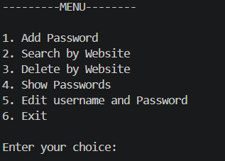
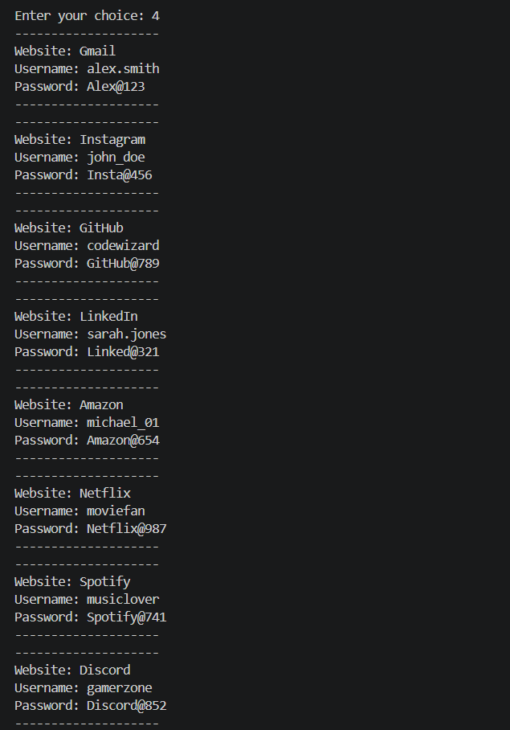
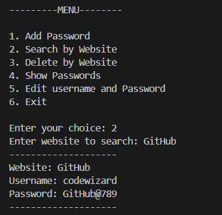
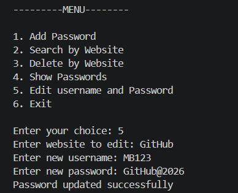
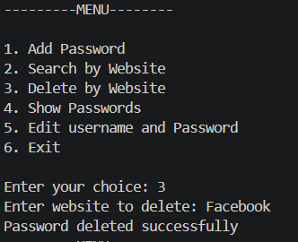

# Password Manager

A Python-based Password Manager that allows users to securely store and manage website credentials using file handling. The application provides features to add, search, edit, and delete passwords through a menu-driven interface.

---

## Features

* Add Password
* Show Saved Passwords
* Search Password by Website
* Edit Existing Passwords
* Delete Passwords
* File-based Storage
* Input Validation
* Menu-driven Program

---

## Technologies Used

* Python
* File Handling
* Functions
* Lists
* Exception Handling

---

## Project Structure

```text
08_Password_Manager/
│
├── password_manager.py
├── passwords.txt
├── README.md
│
└── screenshots/
    ├── Menu.png
    ├── Show.png
    ├── Search.png
    ├── Edit.png
    └── Delete.png
```

---

## Screenshots

### Main Menu



### Show Passwords



### Search Password



### Edit Password



### Delete Password



---

## How to Run

1. Clone the repository.

2. Navigate to the project folder:

```bash
cd 08_Password_Manager
```

3. Run the program:

```bash
python password_manager.py
```

---

## Features Overview

### Add Password

Store website credentials in the file.

### Show Passwords

Display all saved credentials.

### Search Password

Find credentials using the website name.

### Edit Password

Update existing passwords.

### Delete Password

Remove unwanted credentials.

---

## Concepts Practiced

* Functions
* File Handling
* Reading and Writing Files
* Searching Records
* Updating Records
* Deleting Records
* Exception Handling
* Menu Driven Programming
* Problem Solving

---

## Future Improvements

* Hidden Password Input
* Password Generator Integration
* Password Strength Checker
* Duplicate Website Detection
* Password Encryption

---

## Author

**Meet Bhut**
