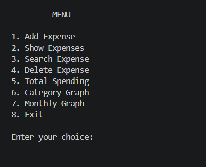
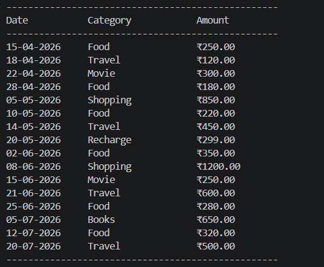
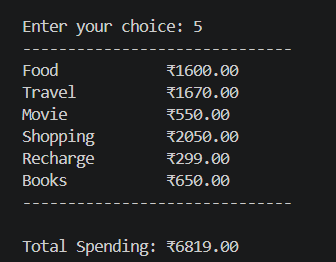
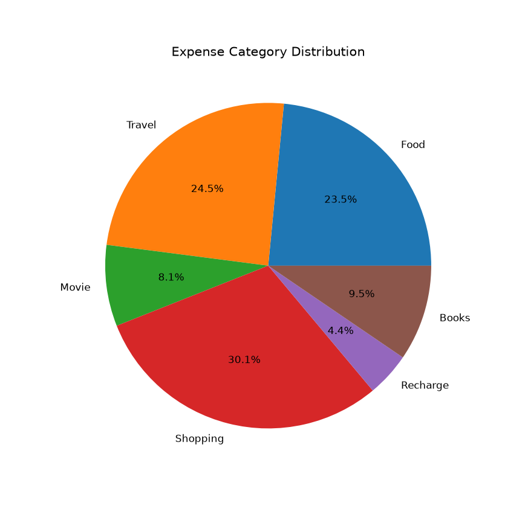
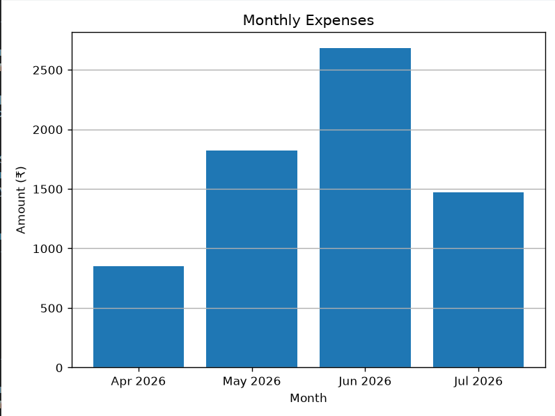

# Expense Tracker

A Python-based Expense Tracker application that helps users manage and analyze their daily expenses. The project stores expense records in a text file and provides visual insights using graphs.

---

## Features

* Add new expenses
* View all expenses
* Search expenses by category
* Delete specific expenses
* Calculate total spending
* Category-wise spending summary
* Expense distribution pie chart
* Monthly spending bar graph
* File-based data storage
* Input validation and exception handling

---

## Technologies Used

* Python
* File Handling
* Dictionaries
* Functions
* Exception Handling
* Date and Time Module
* Matplotlib

---

## Project Structure

```text
09_Expense_Tracker/
│
├── expense_tracker.py
├── expenses.txt
├── README.md
│
└── screenshots/
    ├── menu.png
    ├── expenses.png
    ├── totals.png
    ├── category_chart.png
    └── monthly_chart.png
```

---

## Screenshots

### Main Menu



### Expense Records



### Total Spending



### Category Distribution



### Monthly Expenses



---

## How to Run

1. Clone the repository.

2. Install matplotlib:

```bash
pip install matplotlib
```

3. Run the program:

```bash
python expense_tracker.py
```

---

## Sample Features

* Add expense with category and amount
* Automatically stores current date
* Search expenses by category
* Delete individual expense records
* View category-wise spending totals
* Visualize expenses using graphs

---

## Concepts Practiced

* Functions
* File Handling
* Dictionaries
* Lists
* Exception Handling
* Date Formatting
* Data Aggregation
* Matplotlib Visualization
* Menu-Driven Programming

---

## Future Improvements

* Expense editing feature
* Export data to CSV
* Budget tracking
* User-defined date selection
* Advanced reports and analytics

---

## Author

Created as a Python learning project to practice file handling, data processing, and data visualization.
