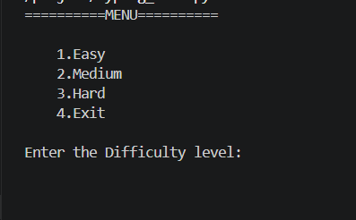
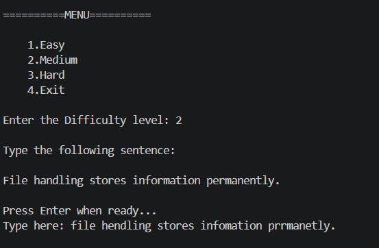
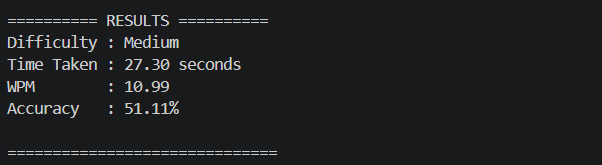
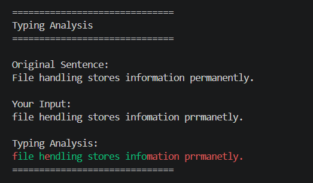

# Typing Speed Tester

A console-based Typing Speed Tester built using Python. The project allows users to test their typing speed and accuracy through different difficulty levels while providing real-time typing analysis.

## Features

* Easy, Medium, and Hard difficulty levels
* Random sentence generation
* Typing timer
* Words Per Minute (WPM) calculation
* Accuracy calculation
* Character-by-character typing analysis
* Green color for correct characters
* Red color for incorrect characters
* Input validation
* Menu-driven interface

## Technologies Used

* Python
* random module
* time module
* colorama
* itertools

## Project Structure

```text
Typing_Speed_Tester/
│
├── typing_speed_tester.py
├── README.md
│
└── screenshots/
    ├── menu.png
    ├── typing_test.png
    ├── results.png
    └── analysis.png
```

## How to Run

1. Clone the repository:

```bash
git clone <repository-url>
```

2. Install the required package:

```bash
pip install colorama
```

3. Run the program:

```bash
python typing_speed_tester.py
```

## Screenshots

### Main Menu



### Typing Test



### Results



### Typing Analysis



## Concepts Practiced

* Functions
* Loops
* Dictionaries
* Lists
* Exception Handling
* String Manipulation
* Modules and Packages
* Time Measurement
* Random Selection
* Character Comparison
* Colored Terminal Output

## Future Improvements

* Leaderboard system
* Save scores to a file
* Best WPM tracking
* Average accuracy statistics
* Performance graphs using Matplotlib
* Countdown timer
* Timed typing mode
* Flask web version

## Author

Meet Bhut
